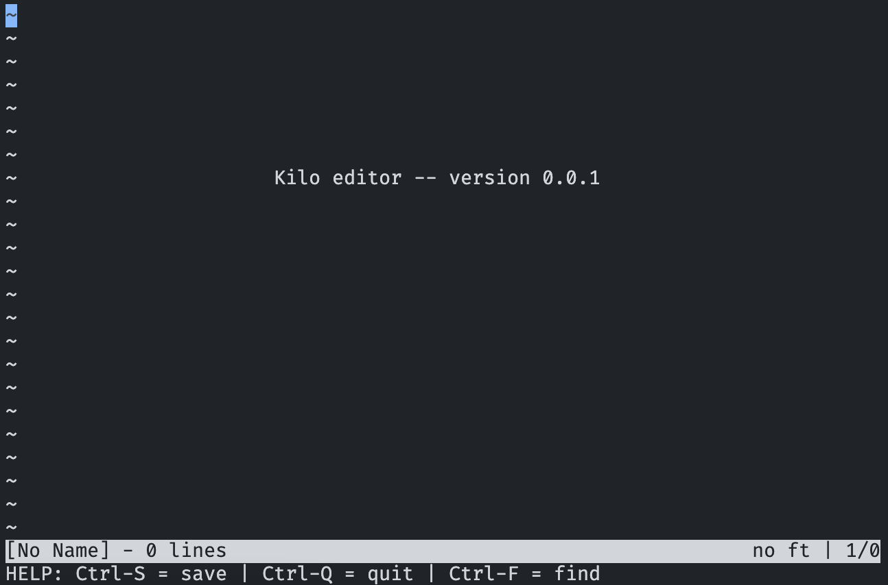
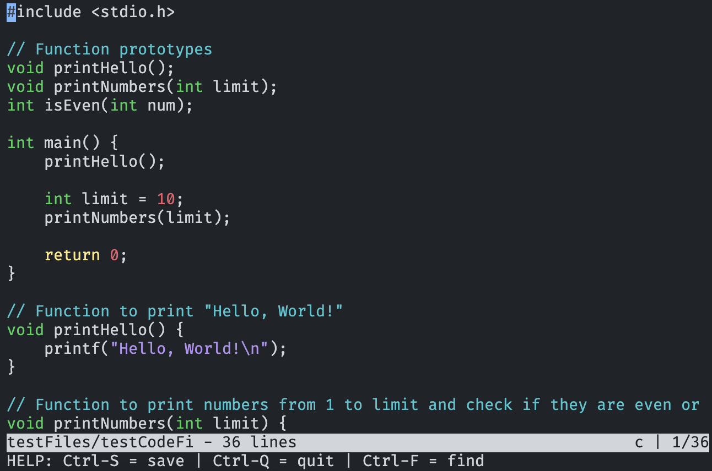

# Kilo Text Editor

> This project is based on the [Kilo Text Editor](https://viewsourcecode.org/snaptoken/kilo/index.html) by Paige and Antirez.

<p align="center">Welcome page</p>
<p align="center"></p>


<p align="center">Editing a code file</p>
<p align="center"></p>


The Project is written in C and showcases the basic tools of a text editor like:

* Creating, opening, editing, and saving files
* Basic syntax highlighting for code triggered by filetype detecting.

The project is loosely inspired by emacs and is run on the terminal.

## Run it locally

Clone the project on your machine

```prompt
git clone git@github.com:ViniciusALS/Kilo-Text-Editor.git
```

Go to its directory

```prompt
cd Kilo-Text-Editor
```

And compile the project

```prompt
make
```

To use the text editor, you can either execute it by itself or pass a file that you wish to edit as argument.

```prompt
./kilo
```

or

```prompt
./kilo testFiles/testCodeFile.c
```

When run by itself, Kilo can create a new file.

## Hot Keys

| Action                 | Command                     | Observation                   |
| ---------------------- | --------------------------- | ----------------------------- |
| Save file              | `ctrl` + `s`                |                               |
| Search                 | `ctrl` + `f`                | Exit search by pressing `ESC` |
| Quit                   | `ctrl` + `q`                |                               |
| Quit without saving    | `ctrl` + `qqq`              |                               |
| Move up one row        | `ARROW_UP` OR               |                               |
| Move down one row      | `ARROW_DOWN`                |                               |
| Move to the left       | `ARROW_LEFT`                |                               |
| Move to the right      | `ARROW_RIGHT`               |                               |
| Move to start of line  | `HOME` OR `crtl` + `a`      |                               |
| Move to end of line    | `END` OR `crtl` + `d`       |                               |
| Move to top of page    | `PAGE_UP` OR `crtl` + `i`   |                               |
| Move to botton of page | `PAGE_DOWN` OR `crtl` + `j` |                               |
| Delete                 | `DELETE`                    |                               |
| Backspace              | `BACKSPACE`                 |                               |
